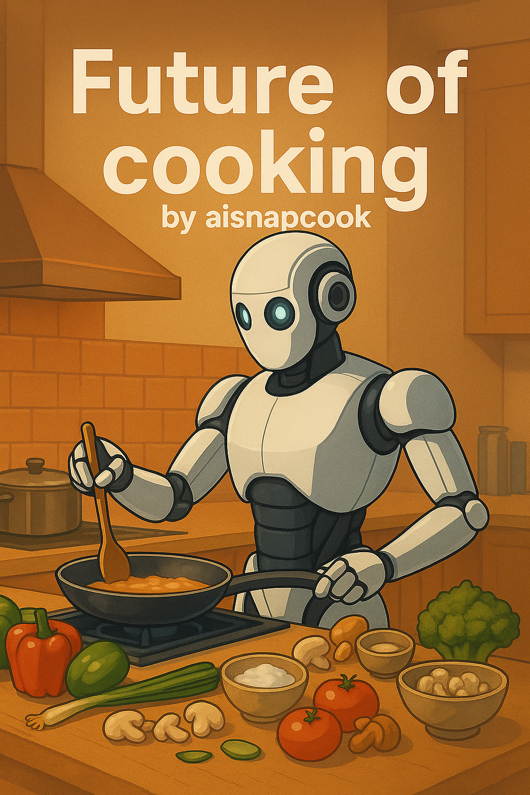

# 🍳 SnapCook - AI-Powered Recipe Generator

SnapCook is an intelligent recipe generation platform that transforms your available ingredients into personalized, delicious recipes using advanced AI technology. Simply snap a photo of your ingredients, type them in, input to receive instant, tailored recipe suggestions with nutritional insights and cooking instructions.

## ✨ Features

- **🤖 AI-Powered Recipe Generation** - Leverages Google Gemini 2.5 Flash for intelligent recipe suggestions
- **📸 Multi-Input Methods** - Text, image upload, or voice input for ingredient recognition
- **🔐 Secure Authentication** - Clerk-powered authentication with social login support
- **💳 Flexible Pricing Plans** - Free, Pro, and Max tiers with Clerk Billing integration
- **📊 Nutritional Information** - Detailed nutritional breakdown for every recipe
- **⏱️ Time-Based Filtering** - Filter recipes by preparation and cooking time
- **🎨 Beautiful UI/UX** - Modern, responsive design with smooth animations
- **💾 Recipe Management** - Save, view, and manage your generated recipes
- **📧 Contact Form** - Integrated EmailJS for user inquiries
- **🌙 Smooth Animations** - Framer Motion for delightful user interactions

## 🛠️ Tech Stack

### Frontend
- **[Next.js 15](https://nextjs.org/)** - React framework with App Router
- **[React 19](https://react.dev/)** - UI library
- **[TypeScript](https://www.typescriptlang.org/)** - Type-safe development
- **[Tailwind CSS 4](https://tailwindcss.com/)** - Utility-first CSS framework
- **[shadcn/ui](https://ui.shadcn.com/)** - Re-usable component library
- **[Framer Motion](https://www.framer.com/motion/)** - Animation library
- **[Radix UI](https://www.radix-ui.com/)** - Headless UI components
- **[Lucide Icons](https://lucide.dev/)** - Beautiful icon library

### Backend & Database
- **[Next.js API Routes](https://nextjs.org/docs/app/building-your-application/routing/route-handlers)** - Serverless API endpoints
- **[Neon PostgreSQL](https://neon.tech/)** - Serverless Postgres database
- **[Drizzle ORM](https://orm.drizzle.team/)** - TypeScript ORM for database operations

### AI & Services
- **[Google Gemini 2.5 Flash](https://deepmind.google/technologies/gemini/)** - Multimodal AI model for recipe generation
- **[Clerk](https://clerk.com/)** - Authentication and user management with billing
- **[EmailJS](https://www.emailjs.com/)** - Email service for contact form
- **[Sonner](https://sonner.emilkowal.ski/)** - Toast notifications

### DevOps & Deployment
- **[Vercel](https://vercel.com/)** - Deployment and hosting platform
- **[Drizzle Kit](https://orm.drizzle.team/kit-docs/overview)** - Database migrations and schema management

## 🚀 Getting Started

### Prerequisites

- Node.js 18+ and npm
- A Neon PostgreSQL database account
- Clerk account for authentication
- Google AI API key (Gemini)
- EmailJS account (optional, for contact form)

### Installation

1. **Clone the repository**
   ```bash
   git clone https://github.com/yourusername/snapcook.git
   cd snapcook
   ```

2. **Install dependencies**
   ```bash
   npm install
   ```

3. **Set up environment variables**

   Create a `.env` file in the root directory:
   ```env
   # Database (Neon PostgreSQL)
   DATABASE_URL=your_neon_database_url

   # Clerk Authentication
   NEXT_PUBLIC_CLERK_PUBLISHABLE_KEY=your_clerk_publishable_key
   CLERK_SECRET_KEY=your_clerk_secret_key
   NEXT_PUBLIC_CLERK_SIGN_IN_URL=/sign-in
   NEXT_PUBLIC_CLERK_SIGN_IN_FALLBACK_REDIRECT_URL=/
   NEXT_PUBLIC_CLERK_SIGN_UP_FALLBACK_REDIRECT_URL=/

   # Google Gemini AI
   GEMINI_API_KEY=your_gemini_api_key

   # EmailJS (Contact Form)
   NEXT_PUBLIC_EMAILJS_PUBLIC_KEY=your_emailjs_public_key
   NEXT_PUBLIC_EMAILJS_SERVICE_ID=your_emailjs_service_id
   NEXT_PUBLIC_EMAILJS_TEMPLATE_ID=your_emailjs_template_id
   ```

4. **Set up the database**
   ```bash
   npm run db:push
   ```

5. **Run the development server**
   ```bash
   npm run dev
   ```

6. **Open your browser**

   Navigate to [http://localhost:3000](http://localhost:3000)

## 📦 Available Scripts

- `npm run dev` - Start development server with Turbopack
- `npm run build` - Build for production
- `npm start` - Start production server
- `npm run db:generate` - Generate database migrations
- `npm run db:push` - Push schema changes to database
- `npm run db:migrate` - Run database migrations
- `npm run db:studio` - Open Drizzle Studio for database management

## 🗂️ Project Structure

```
snapcook/
├── src/
│   ├── app/                    # Next.js App Router pages
│   │   ├── api/               # API routes
│   │   ├── dashboard/         # Dashboard page
│   │   ├── sign-in/           # Sign-in page
│   │   └── layout.tsx         # Root layout
│   ├── components/            # React components
│   │   ├── ui/               # shadcn/ui components
│   │   ├── navbar.tsx        # Navigation bar
│   │   ├── hero-section.tsx  # Landing page hero
│   │   ├── pricing-section.tsx # Pricing plans
│   │   └── ...               # Other components
│   ├── db/                   # Database configuration
│   │   ├── schema.ts         # Drizzle schema definitions
│   │   └── index.ts          # Database connection
│   └── lib/                  # Utility functions
├── public/                   # Static assets
├── drizzle/                  # Database migrations
└── ...config files
```

## 🌐 Deployment

### Deploy to Vercel

1. **Push your code to GitHub**

2. **Import project to Vercel**
   - Go to [Vercel Dashboard](https://vercel.com/dashboard)
   - Click "Import Project"
   - Select your repository

3. **Configure environment variables**
   - Add all environment variables from your `.env` file
   - Ensure `DATABASE_URL` points to your production Neon database

4. **Deploy**
   - Vercel will automatically build and deploy your application

## 💡 Key Features Explained

### AI Recipe Generation
SnapCook uses Google's Gemini 2.5 Flash model to analyze ingredients and generate contextual recipes. The AI considers:
- Available ingredients
- Dietary preferences
- Cooking time constraints
- Nutritional requirements

### Authentication & Billing
Integrated Clerk authentication provides:
- Social login (Google, etc.)
- Secure user management
- Subscription billing (Free, Pro, Max plans)
- Usage tracking and limits

### Database Architecture
Neon PostgreSQL with Drizzle ORM powers:
- User profiles and authentication
- Recipe storage and retrieval
- Usage tracking per plan
- Efficient querying with TypeScript type safety

## 🤝 Contributing

Contributions are welcome! Please feel free to submit a Pull Request.

## 📄 License

This project is licensed under the MIT License.

## 🙏 Acknowledgments

- [Next.js Team](https://nextjs.org/) for the amazing framework
- [Clerk](https://clerk.com/) for seamless authentication
- [Neon](https://neon.tech/) for serverless PostgreSQL
- [Google](https://deepmind.google/) for Gemini AI
- [shadcn](https://ui.shadcn.com/) for beautiful UI components

## 📞 Contact

Have questions or want to collaborate? Get in touch!

- 📧 **Email:** [narendra.insights@gmail.com](mailto:narendra.insights@gmail.com)
- 💼 **LinkedIn:** [www.linkedin.com/in/nk-analytics](https://www.linkedin.com/in/nk-analytics)

---

**Made with ❤️ by SnapCook Team**

*Transform your ingredients into culinary masterpieces with the power of AI!*
